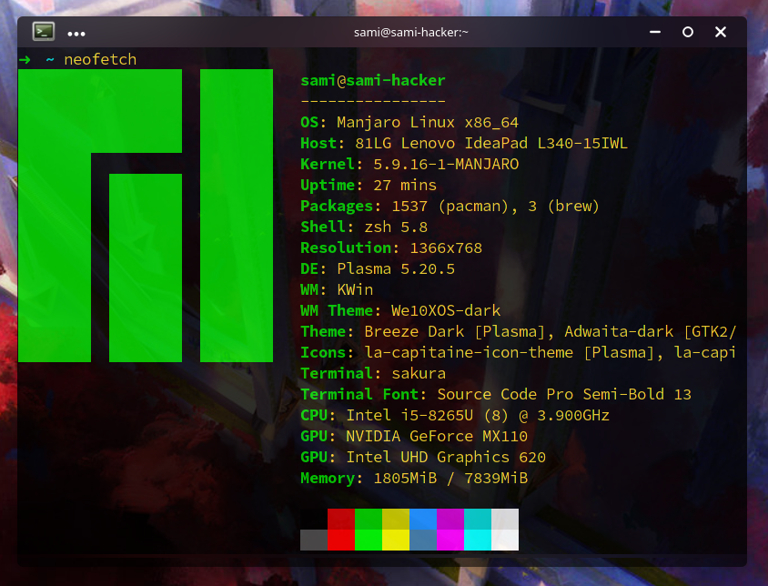

### Hi there 👋

<strong>I'm Sami Ghasemi, or sami2020pro, I'm a student and programmer, currently teaching at silicium and parsclick</strong>

- 🔭 I’m currently working on most **programming languages**
- 🌱 I’m currently learning **Go** and **Rust** and ***Nim***
- 🧊 I’m currently building a web framework for **Nim** language
- ℹ️ I’m currently helping <a href="https://github.com/pashmaklang/pashmak">Pashmak</a>
- 💬 Ask me about BUGs
- 📫 How to reach me: <a href="https://twitter.com/samipro80529617">sami ghasemi</a>

 

  

<!--- 😄 Pronouns: ...
- ⚡ Fun fact: ...
-->
<!--- 👯 I’m looking to collaborate on ...
- 🤔 I’m looking for help with ...-->
